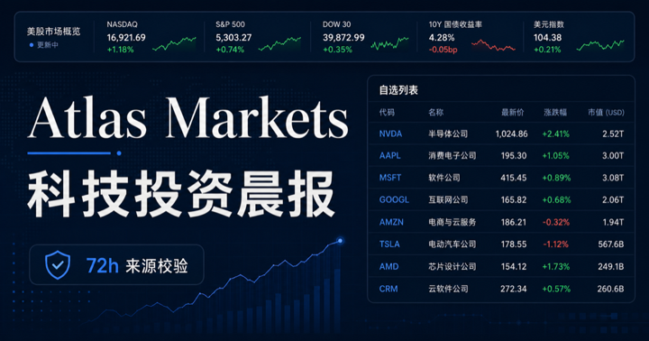
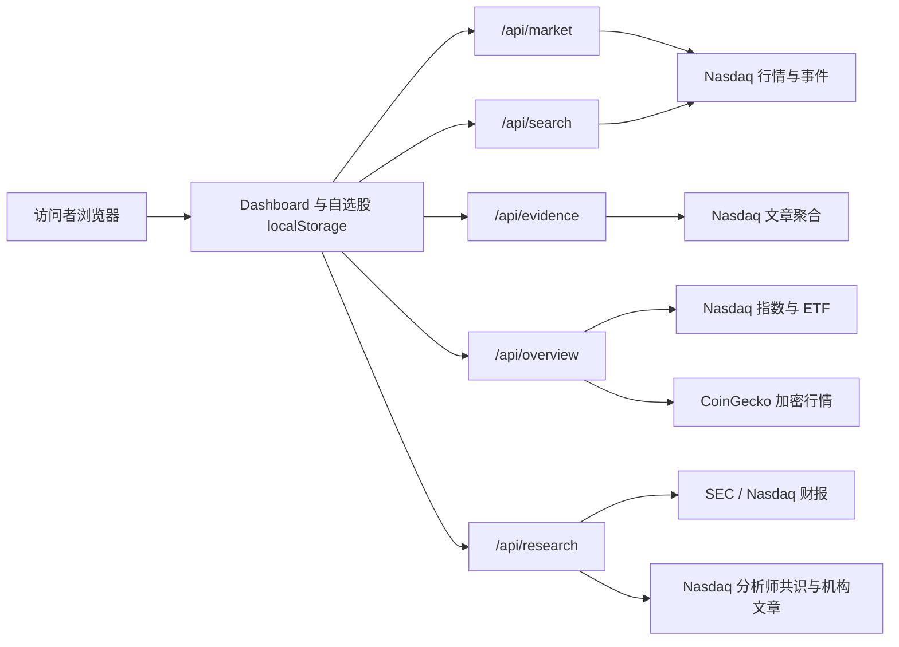

# Atlas Markets Dashboard

面向美股科技行业投资者的开源晨间市场看板，聚合自选股行情、宏观信号、过去 7 天的财报与分析师共识、加密资产以及近期个股证据。



> 本项目仅用于投资研究与软件演示，不构成投资建议。市场数据可能延迟、缺失或受到上游数据源限流；用于交易决策前请与券商或持牌数据源交叉核验。

## 在线演示

[打开 Atlas Markets](https://atlas-tech-markets.zhongpeng202121.chatgpt.site/)

在线演示目前可能要求使用 ChatGPT 登录。GitHub 仓库公开与在线演示站点公开是两项独立设置：公开仓库后，任何人可以查看代码；如需任何人直接访问演示站点，还需要单独调整站点访问权限。

## 核心功能

- 自选股行情：展示最新价、常规交易时段涨跌、盘前/盘后涨跌、当前成交量和日均成交量。
- 自选股编辑：通过 ticker 或公司名称搜索并添加股票，也可从列表中删除股票。
- 本地个性化：每位访问者的自选股保存在自己的浏览器中，不会修改其他人的列表。
- 市场总览：NASDAQ 100、SOX 半导体以及 S&P 500 ETF 等市场指标。
- 科技股核心信号：直接展示 2 年/10 年美债、10 年实际利率、高收益债 OAS、VIX 期限结构、广义美元、WTI 原油和美国天然气。
- 市场状态：根据实际利率、信用利差、波动率期限结构与油价的组合变化，生成规则化的环境提示，并列出触发依据。
- 相对强弱：使用 QQQ/SPY、SOX/NDX 和 QQEW/QQQ 观察科技、半导体和等权市场宽度。
- 宏观交易代理：使用 SPY、TLT、UUP、HYG、QQQ、QQEW 观察可交易市场价格。
- 数据韧性：展示每组数据源健康度；实时请求失败时可保留最多 24 小时的最近成功浏览器快照。
- 官方事件入口：集中链接 BLS、BEA、Federal Reserve 和 CME FedWatch 日历。
- 财报洞察：根据当前设备的自选股自动扫描过去 7 天内的 SEC 财报文件与 Nasdaq EPS surprise。
- 分析师共识：展示 Nasdaq Buy/Hold/Sell 共识、平均/高低目标价、覆盖机构及相对现价空间。
- 顶级机构证据：在 Nasdaq 聚合内容中检索 JPMorgan、Morgan Stanley、Goldman Sachs、BofA、Citi、UBS 和 Jefferies 的评级或目标价动态；仅在原文明确披露时展示。
- 证据约束 Insight：使用确定性规则归纳财报是否超预期、当前评级共识与机构动态，每条结论均链接到对应来源。
- 加密市场：展示 BTC、ETH 的美元价格和 24 小时涨跌。
- 价格波动证据：只展示报道标题、发布时间和来源链接，不主动生成因果归因。
- 72 小时过滤：剔除超过 72 小时、重复标题、带明显转载旧闻标记或明显投资推荐倾向的内容。
- 手动刷新：刷新过程中显示状态，并在部分数据源失败时明确提示。
- 定时刷新：页面载入时立即刷新；页面保持打开时，在访问者浏览器本地时间每天 09:00 再次刷新。

## 自选股如何工作

默认自选股位于 [`app/Dashboard.tsx`](app/Dashboard.tsx) 的 `DEFAULT_WATCHLIST`：

```ts
const DEFAULT_WATCHLIST = ["NVDA", "TSM", "MSFT", "META", "AMZN", "AAPL"];
```

普通用户无需修改代码：

1. 打开看板。
2. 点击“添加自选股”或“搜索 ticker 添加”。
3. 输入 `AMD`、`CRWD` 或公司名称。
4. 点击搜索结果中的“添加”。
5. 点击股票行右侧的 `×` 可删除股票。

每台设备最多保存 30 个 ticker，存储键为 `atlas-watchlist-v1`。数据仅保存在当前浏览器的 `localStorage` 中：

- 不需要注册数据库账户。
- 不会在用户之间共享。
- 不会自动跨浏览器或跨设备同步。
- 清除浏览器网站数据后会恢复默认列表。

如需手动重置，可在浏览器开发者工具中执行：

```js
localStorage.removeItem("atlas-watchlist-v1");
location.reload();
```

## 数据来源与口径

| 模块 | 数据来源 | 当前口径 |
| --- | --- | --- |
| 股票行情 | [Nasdaq](https://www.nasdaq.com/market-activity/stocks) | 最新可用成交价、常规时段涨跌、盘前/盘后涨跌、成交量 |
| ticker 搜索 | Nasdaq | 美股和 ETF 搜索结果 |
| 指数与市场代理 | Nasdaq | NDX、SOX、SPY、TLT、UUP、HYG、QQQ、QQEW |
| 利率、信用、波动与商品 | [FRED](https://fred.stlouisfed.org/) | DGS2、DGS10、DFII10、BAMLH0A0HYM2、VIXCLS、VXVCLS、DTWEXBGS、DCOILWTICO、DHHNGSP |
| 波动率期限结构说明 | [Cboe](https://www.cboe.com/tradable-products/vix/term-structure/) | VIX 与 3 个月隐含波动率的相对关系 |
| 加密资产 | [CoinGecko](https://www.coingecko.com/) | BTC、ETH 美元价格及 24 小时涨跌 |
| 财报原始文件 | [SEC EDGAR](https://www.sec.gov/edgar/search/)；Nasdaq SEC Filings 回退 | 过去 7 天的 10-Q、10-K、20-F、6-K，以及可确认属于业绩披露的 8-K |
| 财报 surprise | [Nasdaq Earnings](https://www.nasdaq.com/market-activity/earnings) | 报告 EPS、市场一致预期和 surprise 百分比 |
| 分析师共识与目标价 | Nasdaq Analyst Research | Buy/Hold/Sell 共识、覆盖机构、平均/高低目标价；目标价在 Nasdaq 页面中标注由 TipRanks 提供 |
| 顶级机构动态 | Nasdaq 聚合文章 | 过去 7 天内明确提及指定机构与评级/目标价动作的标题及来源链接；属于尽力覆盖，不代表完整投行研报库 |
| 相关证据 | Nasdaq 聚合文章 | 过去 72 小时内的标题、时间和来源链接 |

当前版本不需要 API Key。上游公开接口可能调整格式、限流或暂停服务，因此页面不会在接口失败时伪造兜底价格，而是显示“暂不可用”或“部分更新”。如需商业化、高频刷新或更严格的数据服务等级，请替换为有正式授权和 SLA 的行情/资讯提供商。

## 看板结构



主要文件：

```text
app/
├── Dashboard.tsx          # 看板界面、刷新逻辑、自选股增删与本地存储
├── globals.css            # 页面样式和响应式布局
├── layout.tsx             # 页面元信息与社交分享卡片
├── page.tsx               # 首页入口
└── api/
    ├── market/route.ts    # 自选股行情、成交量与近期公司事件
    ├── search/route.ts    # ticker / 公司名称搜索
    ├── evidence/route.ts  # 72 小时资讯证据与过滤
    ├── overview/route.ts  # 指数、宏观交易代理与加密资产
    └── research/route.ts  # 7 天财报、分析师共识、机构证据与规则化 Insight
public/
└── og.png                 # 项目预览图
.openai/hosting.json       # OpenAI Sites 项目绑定配置
package.json               # 依赖和开发命令
vite.config.ts             # vinext / Cloudflare 开发配置
worker/index.ts            # Worker 入口
```

## 本地运行

### 环境要求

- Node.js `>= 22.13.0`
- npm
- Git

### 直接克隆

适合只想在本地运行或阅读代码的用户：

```bash
git clone https://github.com/JoeZhong2002/atlas-markets-dashboard.git
cd atlas-markets-dashboard
npm install
npm run dev
```

开发服务器启动后，按终端显示的本地地址访问，通常为：

```text
http://localhost:3000
```

### 验证生产构建

```bash
npm run build
```

其他命令：

| 命令 | 用途 |
| --- | --- |
| `npm run dev` | 启动本地开发服务器 |
| `npm run build` | 构建生产版本 |
| `npm test` | 执行项目测试 |
| `npm run lint` | 执行代码检查 |

## Fork 后创建自己的版本

如果你希望长期维护自己的自选股看板，推荐使用 Fork：

1. 在 GitHub 仓库右上角点击 **Fork**。
2. 将 Fork 克隆到本地。
3. 修改 `DEFAULT_WATCHLIST`、页面名称、配色或数据源。
4. 创建自己的分支并提交修改。
5. 部署到自己的站点或 Cloudflare Workers 兼容环境。

```bash
git clone https://github.com/YOUR_GITHUB_USERNAME/atlas-markets-dashboard.git
cd atlas-markets-dashboard
npm install
git switch -c feature/my-dashboard
npm run dev
```

若希望向原项目贡献代码：

```bash
git remote add upstream https://github.com/JoeZhong2002/atlas-markets-dashboard.git
git fetch upstream
git rebase upstream/main
```

完成修改后推送到自己的 Fork，并向原仓库提交 Pull Request。

## 部署自己的副本

### 使用 OpenAI Sites

本仓库包含 `.openai/hosting.json`。其中的 `project_id` 绑定维护者的现有演示站点，不应被 Fork 用户继续使用。

部署自己的副本前：

1. 在你的 Fork 中将 `.openai/hosting.json` 的 `project_id` 改为 `null`。
2. 使用你自己的 OpenAI Sites 工作区创建新站点。
3. 将系统返回的新 `project_id` 写回该文件。
4. 构建并发布你自己的站点版本。
5. 根据需要将站点权限设置为仅自己、工作区或公开访问。

示例：

```json
{
  "project_id": null,
  "d1": null,
  "r2": null
}
```

不要把访问令牌、API Key、Cookie 或私钥提交到 GitHub。后续如果接入需要密钥的数据源，应使用部署平台的环境变量或密钥管理功能。

### 其他平台

项目使用 Next.js API 路由、vinext 和 Cloudflare Worker 兼容构建。迁移到其他托管平台时，需要确认平台支持：

- 服务端 API 路由；
- 对 Nasdaq 和 CoinGecko 的出站 HTTPS 请求；
- Node.js 22 或兼容的 Worker 运行时；
- `cache: "no-store"` 与请求超时行为。

## 当前开源状态

- GitHub 仓库已设为 Public，任何人都可以查看、Clone 和 Fork。
- 在线演示站已开放公开访问；每位访客的自选股仍只保存在自己的浏览器中。
- 当前代码使用 MIT License。
- Issues 已开放，欢迎反馈问题或提交改进建议。

维护者仍应定期检查 Git 历史、依赖漏洞和数据源条款，确保没有访问令牌、API Key、Cookie、私钥或其他不应公开的信息进入仓库。

## 开源许可证

本项目采用 [MIT License](LICENSE)。你可以使用、复制、修改、合并、发布、分发、再许可或销售本软件的副本，但需要在软件副本或重要部分中保留原始版权与许可证声明。

## 贡献指南

欢迎通过 Issue 或 Pull Request 提交：

- 新的数据源适配；
- 更严格的资讯时效与原始来源识别；
- 财报日历和宏观事件日历；
- 跨设备自选股同步；
- 测试、可访问性和移动端体验改进。

提交 Pull Request 前请至少运行：

```bash
npm run build
npm run lint
```

## 已知限制

- 自选股仅存储在浏览器本地，暂不支持账户同步。
- 每日 09:00 刷新由浏览器定时器触发；浏览器关闭时不会运行后台任务。
- 免费公开数据源可能延迟、限流或修改响应格式。
- “证据动态”只展示近期标题和来源，不证明新闻与价格波动存在因果关系。
- FRED 日频序列通常滞后于盘中市场，不应用作实时交易报价；页面会显示对应观测日期。
- 市场状态属于透明规则化提示，不是预测模型，也不应被解释为买卖建议。
- CME FedWatch 目前作为官方外链提供，页面不抓取或重新分发其授权数据。
- Nasdaq Analyst Research 主要提供市场共识、覆盖机构与汇总目标价，并不保证返回逐家机构的最新评级和目标价。系统不会把“覆盖机构”误标为“近期评级事件”。
- Nasdaq 网页接口不是正式商业数据服务，字段和可用性可能变化；财报分析板块会在数据缺失时显示空状态或最近成功快照。
- 规则化 Insight 只归纳已取得的结构化事实和来源，不读取付费投行研报，也不构成投资建议。
- 当前没有持仓、成本价、收益率或交易功能。

## 免责声明

本项目及其数据仅供学习、研究和信息展示。作者不保证数据的完整性、准确性、及时性或持续可用性，也不对基于本项目作出的投资或交易决定承担责任。使用者应自行遵守数据提供商条款、证券市场规则以及所在司法辖区的法律法规。
